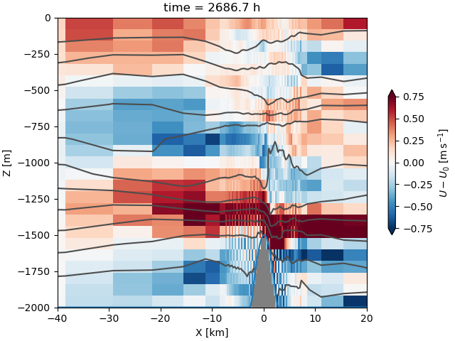

# Example MITgcm setup for steady stratified flow over Gaussian Bump



  - `./code/` contains modified code
  - `./input/` contains the `data*` files and the python script to generate the data sets
  - `./build_options/` contains the compiler flags for macOS 10.
  - `build` is a placeholder for where the gcm should be built
  - `runs` is where you might keep model output.

## Installing and running the code:

The MITgcm requires the openmpi compilers to run in parallel. These are often supplied on a supercluster, sometimes available via a `module load` command if they are not in the default environment.  On a Mac, these compilers used to be challenging to install, but `conda-forge` now has recipes that will install these for you with minimal effort (you can also use `brew`, but that is less portable).

### Using pixi

[pixi](https://pixi.sh/latest/) is a more contained `mamba/conda` that I would recommend for analyzing data, and it works well for MITgcm work as well.  Once you have installed pixi, you can download the requirements for the MITgcm and analysis using python by doing `pixi install` in the top directory of this repo.

If you really just want to check that everything is working, you can now just type `pixi run all`, and the following steps will run in order, as defined in `./pixi.toml`:

- `pixi run downloadmitgcm`: Grabs a recent MITgcm: `git clone --depth 25 git@github.com:jklymak/MITgcm.git`
- `pixi run configure`: Runs the command that makes the `Makefile` for compilation via: `cd build && ../MITgcm/tools/genmake2 -optfile=../build_options/darwin_brewgfortranmpi -mods=../code/ -rootdir=../MITgcm -mpi`
- `pixi run build`: Compiles the model (may take a while) by calling `cd build && make depend && make`.  If this works then there should be a `build/mitgcmuv` file created.
- `pixi run preprun`: Generates the data files that the model needs to run: `cd input && python gendata.py`.  The model is setup in `runs/RunFr1300/`.
- `pixi run run`: Executes the model using MPI.  Note you need at least 4 processors: `cd runs/RunFr1300/input && mpirun -np 4 ../build/mitgcmuv`.  This will take a while to run, and create a bunch of files in `runs/RunFr1300/input`.  If you aren't sure if it is running check for new files there.
- `pixi run analyze`: Opens the jupyternotebook `analyisis/PlotRun.ipynb`.

Note that when using pixi, you need to either get into the `pixi shell` to execute commands like `make`, or you need to do `pixi run make` to ensure the pixi environment is being used.

Similarly, when analyzing the data, make sure that `pixi` is being used as the "environment" or "kernel" in tools like Jupyter lab, or VSCode.

### Manually:

If not using pixi, then you can replicate the steps above manually using conda/mamba

- See the `dependencies` field in `pixi.toml` for what packages to install in your environment.
- You may need to change `build_options/darwin_brewgfortranmpi` to point the `INCLUDES` flag at the location in your environment.
- When you run the steps above, be sure to run them in the environment you created.


#### Compiling

'./build' is where we compile the gcm.  To compile you should run:

```
 /Users/jklymak/MITgcmc66h/MITgcm/tools/genmake2 \
  -optfile=../build_options/darwin_brewgfortranmpi -mods=../code/ \
   -rootdir=/Users/jklymak/MITgcmc66h/MITgcm
```

then `make depend` followed by `make`.

#### Running

**Generate the data**

In `./input`, run `python gendata.py`.

Note that this writes many files in `../runs/RunFr1300`.  This is where
we will run the model from.  Why do we move it?  Because we often want
a number of runs that are similar, and this ensures reproducibility.
In addition to creating the files we need some plots are made into
`../runs/RunFr1300/figs/` that are often useful to make sure we did
what we wanted, and the './input', './code', './build_options', and
'./analysis', directories are saved into this directory as well.
These essentially ensure that the model can be rerun even if the data
is removed.

**Run the model**

Now we can execute the model:
```
mpirun -np 4 ../../build/mitgcmuv
```
where `-np 4` means we want 4 processors (as also specified in `code/SIZE.h`)

The results should be in `../runs/RunFr1300/` and if we used `nf90io`, then the data should be in ``statevars.nc` and `statevars2d.nc`.


## Modifying to your own needs:

You probably don't want to use the simulation provided, so now you need to do the work of creating your own simulation.

### Changing domain size

  1. Change `code/SIZE.h` and recompile.
  3. If using open boundaries change `input/data.obcs`
     i.e. `OB_Jnorth=80*0,` where in this case `ny=80`
  4. Check `data.diagnostics` for the correct data being output for
     your purpose.
  2. Change `input/gendata.py` and rerun `python gendata.py`.  It
     would be good practice to make a new name for the run at this
     point.

### Changing other parameters

  1. Edit  `gendata.py`.  For new runs it is best to change the value of `outdir` right away so you don't overwrite your old runs.

